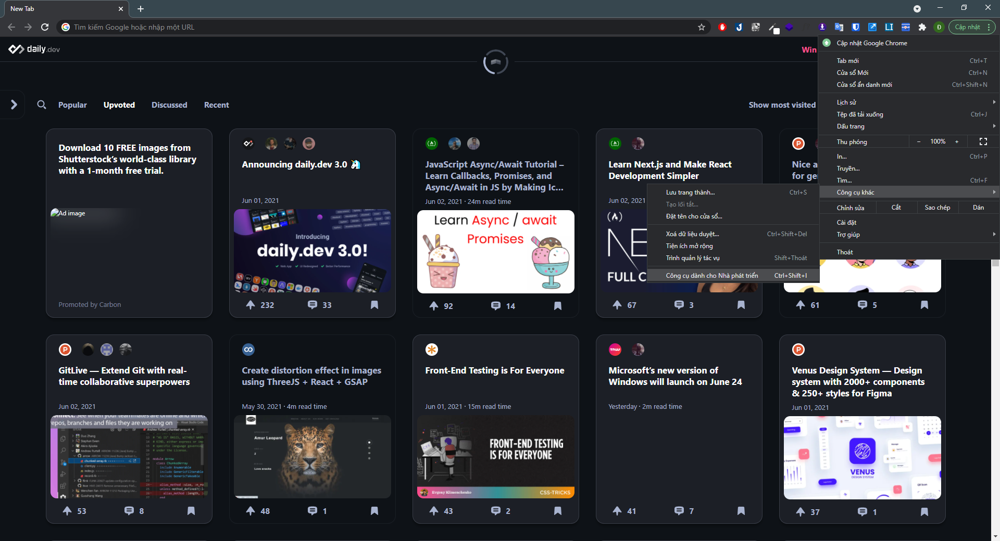
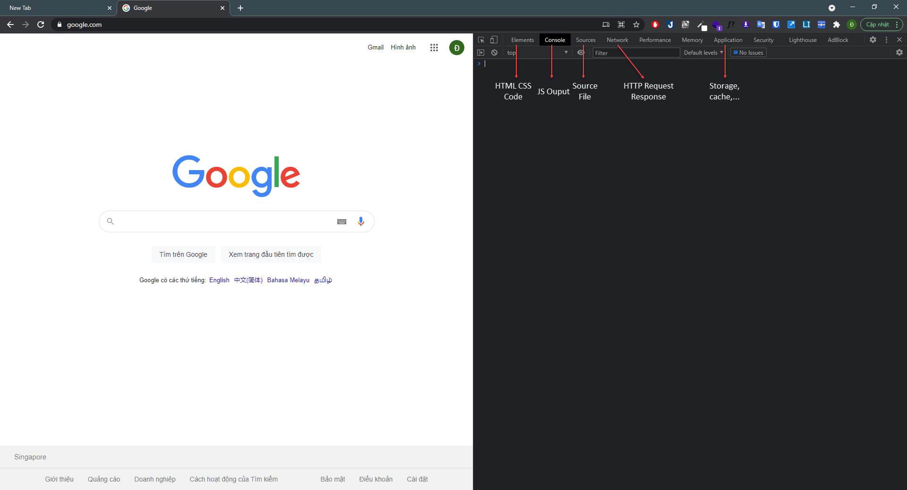
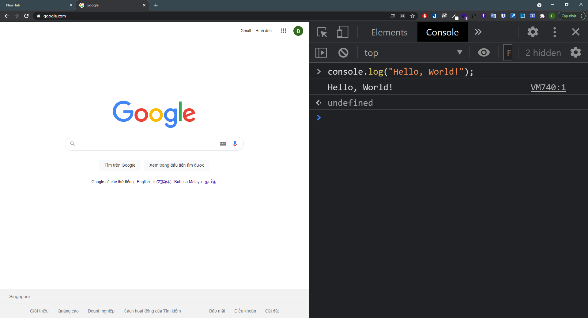
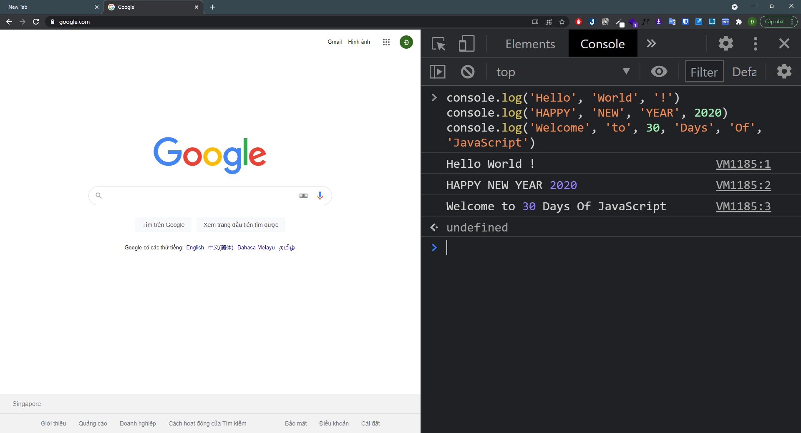
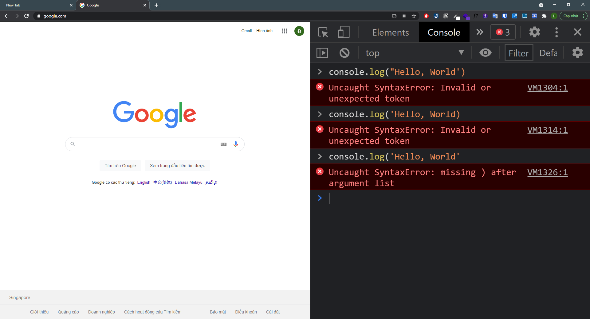
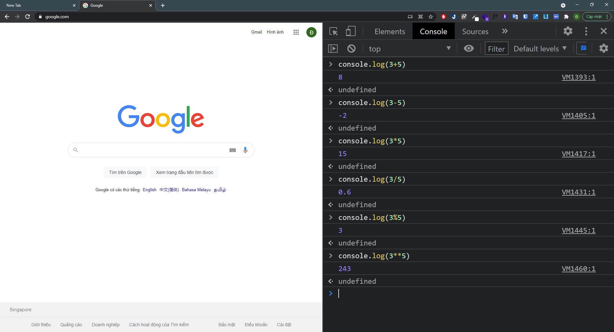
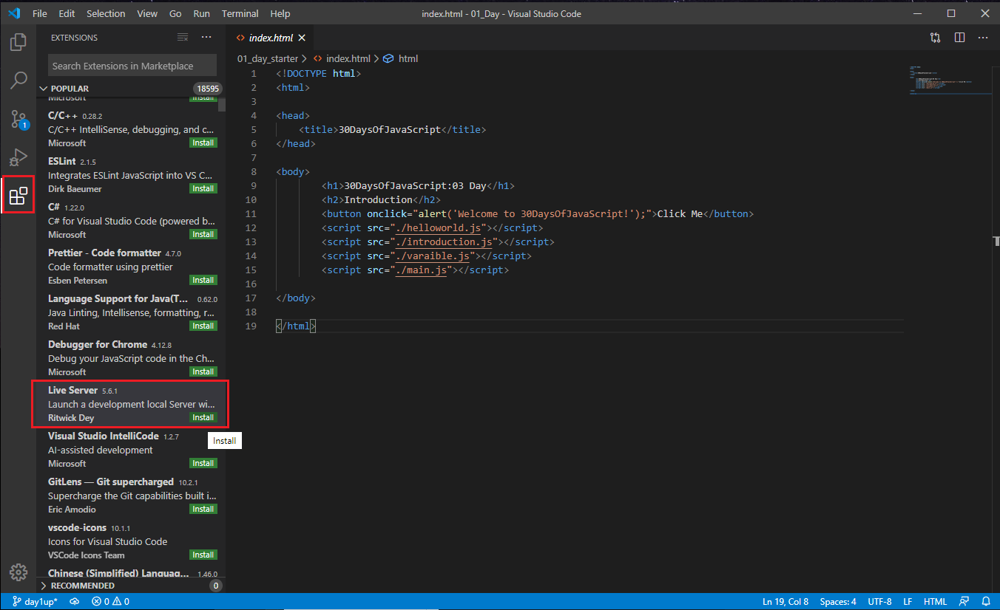
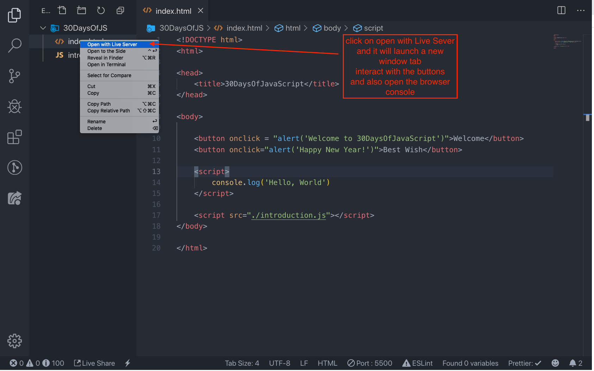

|  # Day      | Topics                                                                  |
| ----------- | ----------------------------------------------------------------------- |
| 01          | [Giới thiệu về Javascript](./30-days-of-javaScript-1-introduction)       |
| Paragraph   | Text                                                         |

🧡🧡🧡 HAPPY CODING 🧡🧡🧡


## 📔 Day 1

### Giới thiệu

**Chúc mừng bạn** đã quyết định tham gia 30 ngày thử thách lập trình JavaScript. Trong thử thách này, bạn sẽ học mọi thứ bạn cần để trở thành một lập trình viên JavaScript, và nói chung là toàn bộ khái niệm về lập trình.

Thử thách **30DaysOfJavaScript** là hướng dẫn cho cả người mới bắt đầu và nhà phát triển JavaScript nâng cao. Chào mừng bạn đến với JavaScript. JavaScript là ngôn ngữ của web. 

Trong thử thách JavaScript từng bước này, bạn sẽ học JavaScript, ngôn ngữ lập trình phổ biến nhất trong lịch sử nhân loại.
JavaScript được sử dụng để **_thêm tính tương tác cho các trang web, để phát triển ứng dụng di động, ứng dụng máy tính để bàn, trò chơi_** và ngày nay JavaScript có thể được sử dụng cho **_machine learning_** và  **_AI_**.
**_JavaScript (JS)_** ngày càng phổ biến trong những năm gần đây và là ngôn ngữ lập trình hàng đầu trong sáu năm liên tiếp và là ngôn ngữ lập trình được sử dụng nhiều nhất trên Github.

<!--truncate-->
### Yêu cầu

Không cần phải có kiến ​​thức trước về lập trình để tuân theo thử thách này. Bạn chỉ cần:

1. Động lực
2. Một máy tính cá nhân
3. Internet
4. Trình duyệt web
5. Code Editor (VSCode, Sublime Text 4, Notepad++, ...)

### Cài đặt môi trường

Tôi tin rằng bạn có động lực và mong muốn mạnh mẽ để trở thành một nhà phát triển, một máy tính và Internet. Nếu bạn có những thứ đó, thì bạn có mọi thứ để bắt đầu.

#### Cài đặt Node.js

Bạn có thể không cần node.js ngay bây giờ nhưng bạn có thể cần nó sau này. Cài đặt [node.js](https://nodejs.org/en/).


Sau khi tải xuống nhấp đúp và cài đặt


Chúng ta có thể kiểm tra xem node đã được cài đặt trên máy cục bộ của chúng tôi hay chưa bằng cách mở terminal (MacOS) hoặc là command prompt (Window)

```sh
C:\Users\trinhdinhtai>node -v
v12.18.3
```

#### Trình duyệt web

Có rất nhiều trình duyệt hiện có. Tuy nhiên, tôi thực sự khuyên bạn nên sử dụng Google Chrome.

##### Cài đặt Google Chrome

Cài đặt [google chrome](https://www.google.com/chrome/) nếu bạn chưa có. Chúng ta có thể viết code JavaScript ngay trên console trình duyệt, nhưng đừng sử dụng console trình duyệt để phát triển ứng dụng.


##### Mở Google Chrome Console

Bạn có thể mở Google Chrome console bằng cách nhấp vào ba dấu chấm ở góc trên cùng bên phải của trình duyệt, chọn _Công cụ khác -> Công cụ dành cho Nhà phát triển_ hoặc sử dụng phím tắt. Tôi thích sử dụng phím tắt hơn.



Để mở Chrome console  bằng phím tắt.

```sh
Mac
Command+Option+J

Windows/Linux:
Ctl+Shift+J
```



Sau khi mở Google Chrome console, hãy thử khám phá các nút được đánh dấu. Chúng ta sẽ dành phần lớn thời gian trên Console. Console là nơi chứa code JavaScript của bạn. Console V8 của Google thay đổi code JavaScript của bạn thành mã máy. Bây giờ, hãy thử viết code JavaScript trên Google Chrome console:



##### Viết Code trên Browser Console

Chúng ta có thể viết bất kỳ code JavaScript nào trên Google console hoặc bất kỳ browser console nào. Tuy nhiên, đối với thử thách này, chúng tôi chỉ tập trung vào bảng điều khiển Google Chrome. Mở bảng điều khiển bằng cách sử dụng:

```sh
Mac
Command+Option+I

Windows:
Ctl+Shift+I
```

###### Console.log

Để viết code JavaScript đầu tiên, chúng ta sẽ sử dụng một hàm tích hợp sẵn **console.log()**. Chúng ta sẽ truyền một đối số làm dữ liệu đầu vào (ở ví dụ này là text "Hello, World!") và hàm hiển thị kết quả đầu ra. 

```js
console.log('Hello, World!')
```

###### Console.log với nhiều đối số

Hàm `console.log()` có thể nhận nhiều tham số được phân tách bằng dấu phẩy. Cú pháp có dạng như sau: `console.log(param1, param2, param3)`



```js
console.log('Hello', 'World', '!')
console.log('HAPPY', 'NEW', 'YEAR', 2020)
console.log('Welcome', 'to', 30, 'Days', 'Of', 'JavaScript')
```

Như bạn có thể thấy từ đoạn code trên, `console.log()` có thể nhận nhiều đối số. Xin chúc mừng! Bạn đã viết code JavaScript đầu tiên của mình bằng `console.log()`.

###### Comments

Chúng ta có thể thêm các comment vào code. Comment rất quan trọng để làm cho code dễ đọc hơn. JavaScript sẽ bỏ qua các comment này khi thực thi code. Trong JavaScript, bất kỳ dòng văn bản nào bắt đầu bằng `//` đều là bình luận và bất kỳ dòng nào kèm theo như sau `/ * * /` cũng là bình luận.

**Ví dụ: Single Line Comment**

```js
// This is the first comment  
// This is the second comment  
// I am a single line comment
```

**Ví dụ: Multiline Comment**

```js
/*
This is a multiline comment  
Multiline comments can take multiple lines  
JavaScript is the language of the web  
*/
```

###### Syntax

Ngôn ngữ lập trình tương tự như ngôn ngữ của con người. Tiếng Anh hoặc nhiều ngôn ngữ khác sử dụng các từ, cụm từ, câu, câu ghép và nhiều thứ khác để truyền tải một thông điệp có ý nghĩa. Ý nghĩa tiếng Anh của cú pháp là _sự sắp xếp của các từ và cụm từ để tạo ra các câu được hình thành tốt trong một ngôn ngữ_. Định nghĩa kỹ thuật của cú pháp là _cấu trúc của các câu lệnh trong một ngôn ngữ máy tính._ Ngôn ngữ lập trình cũng có cú pháp. JavaScript là một ngôn ngữ lập trình và giống như các ngôn ngữ lập trình khác, nó có cú pháp riêng. Nếu chúng ta không viết một cú pháp mà JavaScript hiểu, nó sẽ phát sinh các loại lỗi khác nhau. Chúng ta sẽ khám phá các loại lỗi JavaScript khác nhau ở phần sau. Bây giờ, chúng ta hãy xem lỗi cú pháp.



Tôi đã phạm một sai lầm có chủ ý. Kết quả là console xuất ra lỗi cú pháp. Trên thực tế, cú pháp rất nhiều thông tin. Nó thông báo loại lỗi đã xảy ra. Bằng cách đọc hướng dẫn phản hồi lỗi, chúng tôi có thể sửa cú pháp và khắc phục sự cố. Quá trình xác định và loại bỏ lỗi khỏi chương trình được gọi là gỡ lỗi - debug. Hãy thực hiện sửa lỗi:

```js
console.log('Hello, World!')
console.log('Hello, World!')
```

Cho đến nay, chúng ta đã thấy cách hiển thị văn bản bằng `console.log()`. Nếu chúng ta đang in văn bản hoặc chuỗi bằng `console.log()`, thì văn bản phải nằm trong dấu nháy đơn, dấu nháy kép, hoặc dấu backtick.
**Ví dụ:**

```js
console.log('Hello, World!')
console.log('Hello, World!')
console.log(`Hello, World!`)
```

##### Số học

Bây giờ, chúng ta hãy thực hành viết mã JavaScript nhiều hơn bằng cách sử dụng `_console.log()_` trên google chrome console cho các loại dữ liệu số, chúng ta cũng có thể thực hiện các phép tính toán bằng JavaScript. Hãy thực hiện các phép tính đơn giản sau.
Console có thể trực tiếp nhận các đối số mà không cần hàm `_console.log()_`. Tuy nhiên, nó được đưa vào phần giới thiệu này vì hầu hết thử thách này sẽ diễn ra trong một trình soạn thảo văn bản, nơi việc sử dụng hàm sẽ là bắt buộc. Bạn có thể chơi xung quanh trực tiếp với hướng dẫn trên console.



```js
console.log(3 + 5)  // Phep cộng
console.log(3 - 5)  // Phép trừ
console.log(3 * 5)  // Phép nhân
console.log(3 / 5)  // Phép chia
console.log(3 % 5)  // Phép chia lấy dư
console.log(3 ** 5) // Phép lũy thừa
```

#### Code Editor

Chúng ta có thể viết code của mình trên console của trình duyệt, nhưng nó sẽ không hiệu quả đối với các dự án lớn hơn. Trong môi trường làm việc thực tế, các nhà phát triển sử dụng các code editors khác nhau để viết code của họ. Trong thử thách JavaScript 30 ngày này, chúng tôi sẽ sử dụng Visual Studio Code.

##### Cài đặt Visual Studio Code

Visual studio code là một trình soạn thảo văn bản mã nguồn mở rất phổ biến. Tôi khuyên bạn nên tải xuống [download Visual Studio Code](https://code.visualstudio.com/), nhưng nếu bạn thích các trình chỉnh sửa khác, hãy làm theo những gì bạn có.


Nếu bạn đã cài đặt Visual Studio Code, hãy sử dụng nó.

##### Cách sử dụng Visual Studio Code

Mở Visual Studio bằng cách nhấp đúp vào biểu tượng của nó. Khi bạn mở ra, bạn sẽ thấy giao diện như bên dưới. Hãy tương tác với các biểu tượng mà tôi đã khoanh đỏ.







### Thêm JavaScript vào trang web

JavaScript có thể được thêm vào một trang web theo ba cách khác nhau:

- **_Inline script_**
- **_Internal script_**
- **_External script_**
- **_Multiple External scripts_**

Các phần sau đây trình bày các cách khác nhau để thêm JavaScript vào trang web của bạn.

#### Inline Script

Tạo một thư mục dự án trên màn hình của bạn hoặc ở bất kỳ vị trí nào, đặt tên là 30DaysOfJS và tạo tệp `index.html` trong thư mục dự án. Sau đó, dán mã sau và mở nó trong trình duyệt, chẳng hạn [Chrome](https://www.google.com/chrome/).

```html
<!DOCTYPE html>
<html>
  <head>
    <title>30DaysOfScript:Inline Script</title>
  </head>
  <body>
    <button onclick="alert('Welcome to 30DaysOfJavaScript!')">Click Me</button>
  </body>
</html>
```

Bây giờ, bạn vừa viết một inline script.. Chúng ta có thể tạo một thông báo cảnh báo bật lên bằng cách sử dụng hàm tích hợp `alert()`.

#### Internal Script

Internal script có thể được viết ở phần _head_ hoặc phần _body_, nhưng ưu tiên hơn là đặt nó ở phần _body_ của tài liệu HTML.
Đầu tiên, chúng ta hãy viết trên phần đầu của trang.

```html
<!DOCTYPE html>
<html>
  <head>
    <title>30DaysOfScript:Internal Script</title>
    <script>
      console.log('Welcome to 30DaysOfJavaScript')
    </script>
  </head>
  <body></body>
</html>
```

Đây là cách chúng ta viết internal script. Viết mã JavaScript trong phần _body_ là tùy chọn ưu tiên nhất. Mở browser console để xem kết quả từ `console.log()`

```html
<!DOCTYPE html>
<html>
  <head>
    <title>30DaysOfScript:Internal Script</title>
  </head>
  <body>
    <button onclick="alert('Welcome to 30DaysOfJavaScript!');">Click Me</button>
    <script>
      console.log('Welcome to 30DaysOfJavaScript')
    </script>
  </body>
</html>
```

Mở browser console để xem kết quả từ `console.log()`


#### External Script

Tương tự như internal script, external script có thể nằm phần _head_ hoặc phần _body_, nhưng ưu tiên hơn là đặt nó ở phần _body_. Đầu tiên, chúng ta nên tạo một tệp JavaScript bên ngoài với phần mở rộng .js. Tất cả các tệp kết thúc bằng phần mở rộng .js. Tất cả các tệp kết thúc bằng phần mở rộng .js đều là tệp JavaScript. Tạo một tệp có tên là Introduction.js bên trong thư mục dự án của bạn và viết đoạn code sau và liên kết tệp .js này ở cuối _body_.

```js
console.log('Welcome to 30DaysOfJavaScript')
```

External scripts ở _head_:

```html
<!DOCTYPE html>
<html>
  <head>
    <title>30DaysOfJavaScript:External script</title>
    <script src="introduction.js"></script>
  </head>
  <body></body>
</html>
```

External scripts ở _body_:

```html
<!DOCTYPE html>
<html>
  <head>
    <title>30DaysOfJavaScript:External script</title>
  </head>
  <body>
    //it could be in the header or in the body // Here is the recommended place
    to put the external script
    <script src="introduction.js"></script>
  </body>
</html>
```

Mở browser console để xem kết quả từ `console.log()`

#### Multiple External Scripts

Chúng tôi cũng có thể liên kết nhiều tệp JavaScript bên ngoài với một trang web. Tạo tệp helloworld.js bên trong thư mục 30DaysOfJS và viết code sau.

```js
console.log('Hello, World!')
```

```html
<!DOCTYPE html>
<html>
  <head>
    <title>Multiple External Scripts</title>
  </head>
  <body>
    <script src="./helloworld.js"></script>
    <script src="./introduction.js"></script>
  </body>
</html>
```

_Tệp main.js của bạn phải nằm bên dưới tất cả các tập lệnh khác_. Nó là rất quan trọng để ghi nhớ điều này.


#### Giới thiệu về Data types

Trong JavaScript và các ngôn ngữ lập trình khác, có nhiều loại kiểu dữ liệu khác nhau. Sau đây là các kiểu dữ liệu nguyên thủy của JavaScript:_String, Number, Boolean, undefined, Null_, và _Symbol_.

##### Numbers (Kiểu số)

- Số nguyên (Integers):  Số âm, số 0, số dương  
  Ví dụ:
  ... -3, -2, -1, 0, 1, 2, 3 ...
- Số thực:  
  Ví dụ
  ... -3.5, -2.25, -1.0, 0.0, 1.1, 2.2, 3.5 ...

##### Strings (Kiểu chuỗi)

Là một tập hợp một hoặc nhiều ký tự nằm giữa hai dấu nháy đơn, nháy kép hoặc hoặc dấu backtick..
**Ví dụ:**

```js
'TaiTD'
'VietNam'
'JavaScript is a beautiful programming language'
'I love teaching'
'I hope you are enjoying the first day'`We can also create a string using a backtick`
;('A string could be just as small as one character as big as many pages')
```

#### Booleans

Giá trị boolean là True hoặc False. Mọi so sánh đều trả về giá trị boolean, đúng hoặc sai.

Kiểu dữ liệu boolean là giá trị true hoặc false.

**Ví dụ:**

```js
true // if the light on ,the value is true
false // if the light off, the value is false
```

#### Undefined

Trong JavaScript, nếu chúng ta không gán giá trị cho một biến thì giá trị đó không được xác định. Ngoài ra, nếu một hàm không trả về bất kỳ thứ gì, nó sẽ trả về không xác định.

```js
let firstName
console.log(firstName) //not defined, because it is not assigned to a value yet
```

#### Null

Null trong JavaScript có nghĩa là một giá trị rỗng.

```js
let emptyValue = null
```

### Kiểm tra Data Types

Để kiểm tra kiểu dữ liệu của một biến nào đó, chúng ta sử dụng toán tử `typeof`. Xem ví dụ sau.  

```js
console.log(typeof 'TaiTD') // string
console.log(typeof 5) // number
console.log(typeof true) // boolean
console.log(typeof null) // object type
console.log(typeof undefined) // undefined
```

### Comments Again

RHãy nhớ rằng comment trong JavaScript cũng tương tự như các ngôn ngữ lập trình khác. Nhận xét rất quan trọng trong việc làm cho mã của bạn dễ đọc hơn. Có hai cách comment:

- _Single line commenting_
- _Multiline commenting_

```js
// commenting the code itself with a single comment
// let firstName = 'TaiTD'; single line comment
// let lastName = 'Trinh'; single line comment
```

Multiline commenting:

```js
/*
    let location = 'HaNoi';
    let age = 100;
    let isMarried = true;
    This is a Multiple line comment
    */
```

### Variables (Biến)

Biến là _vùng chứa_ dữ liệu. Các biến được sử dụng để _lưu trữ_ dữ liệu trong một vị trí bộ nhớ. Khi một biến được khai báo, một vị trí bộ nhớ sẽ được bảo lưu. Khi một biến được gán cho một giá trị (dữ liệu), không gian bộ nhớ sẽ được lấp đầy bởi dữ liệu đó. Để khai báo một biến, chúng ta sử dụng các từ khóa `var`, `let`, hoặc `const`.

Đối với một biến thay đổi vào một thời điểm khác, chúng ta sử dụng `let`. Nếu dữ liệu không thay đổi, chúng ta sử dụng `const`. Ví dụ, PI, tên quốc gia, trọng lực không thay đổi và chúng ta có thể sử dụng `const`. Chúng ta sẽ không sử dụng var trong thử thách này và tôi không khuyên bạn nên sử dụng nó. Đây là cách dễ bị lỗi khi khai báo biến, nó có rất nhiều lỗ hổng. Chúng ta sẽ nói chi tiết hơn về `var`, `let` và `const` trong các phần (phạm vi) khác. Còn bây giờ, lời giải thích trên là đủ.

Tên biến JavaScript hợp lệ phải tuân theo các quy tắc sau:

- Tên biến JavaScript không được bắt đầu bằng một số.
- Tên biến JavaScript không cho phép các ký tự đặc biệt ngoại trừ ký hiệu đô la và dấu gạch dưới.
- Tên biến JavaScript tuân theo quy ước camelCase.
- Tên biến JavaScript không được có khoảng trắng giữa các từ.

Sau đây là các ví dụ về các biến JavaScript hợp lệ.

```js
firstName
lastName
country
city
capitalCity
age
isMarried

first_name
last_name
is_married
capital_city

num1
num_1
_num_1
$num1
year2020
year_2020
```

Các biến đầu tiên và thứ hai trong danh sách tuân theo quy ước camelCase khai báo trong JavaScrip. Trong tài liệu này, chúng tôi sẽ sử dụng các biến camelCase.

Ví dụ về các biến không hợp lệ:

```sh
  first-name
  1_num
  num_#_1
```

Chúng ta hãy khai báo các biến với các kiểu dữ liệu khác nhau. Để khai báo một biến, chúng ta cần sử dụng từ khóa `let` hoặc `const` trước tên biến. Theo sau tên biến, chúng ta viết một dấu bằng (toán tử gán) và một giá trị (dữ liệu được gán).

```js
// Syntax
let nameOfVariable = value
```

**Ví dụ về khai báo biến**

```js
// Declaring different variables of different data types
let firstName = 'TaiTD' // first name of a person
let lastName = 'Trinh' // last name of a person
let country = 'VietNam' // country
let city = 'HaNoi' // capital city
let age = 100 // age in years
let isMarried = true

console.log(firstName, lastName, country, city, age, isMarried)
```

```sh
TaiTD Trinh VietNam HaNoi 100 True
```

```js
// Declaring variables with number values
let age = 100 // age in years
const gravity = 9.81 // earth gravity  in m/s2
const boilingPoint = 100 // water boiling point, temperature in oC
const PI = 3.14 // geometrical constant

console.log(gravity, boilingPoint, PI)
```

```sh
9.81 100 3.14
```

```js
// Variables can also be declaring in one line separated by comma
let name = 'TaiTD', // name of a person
  job = 'teacher',
  live = 'VietNam'
console.log(name, job, live)
```

```sh
TaiTD teacher VietNam
```

🌕 Bạn thật tuyệt! Bạn vừa hoàn thành thử thách ngày 1 và bạn đang trên đường vươn tới sự vĩ đại. Bây giờ thực hiện một số bài tập cho não và cơ bắp của bạn.

## 💻 Day 1: Exercises

1. Write a single line comment which says, _comments can make code readable_
2. Write another single comment which says, _Welcome to 30DaysOfJavaScript_
3. Write a multiline comment which says, _comments can make code readable, easy to reuse_
   _and informative_

4. Create a variable.js file and declare variables and assign string, boolean, undefined and null data types
5. Create datatypes.js file and use the JavaScript **_typeof_** operator to check different data types. Check the data type of each variable
6. Declare four variables without assigning values
7. Declare four variables with assigned values
8. Declare variables to store your first name, last name, marital status, country and age in multiple lines
9. Declare variables to store your first name, last name, marital status, country and age in a single line
10. Declare two variables _myAge_ and _yourAge_ and assign them initial values and log to the browser console.

```sh
I am 25 years old.
You are 30 years old.
```

🎉 CONGRATULATIONS ! 🎉

[Day 2 >>](./30-days-of-javaScript-1-introduction)